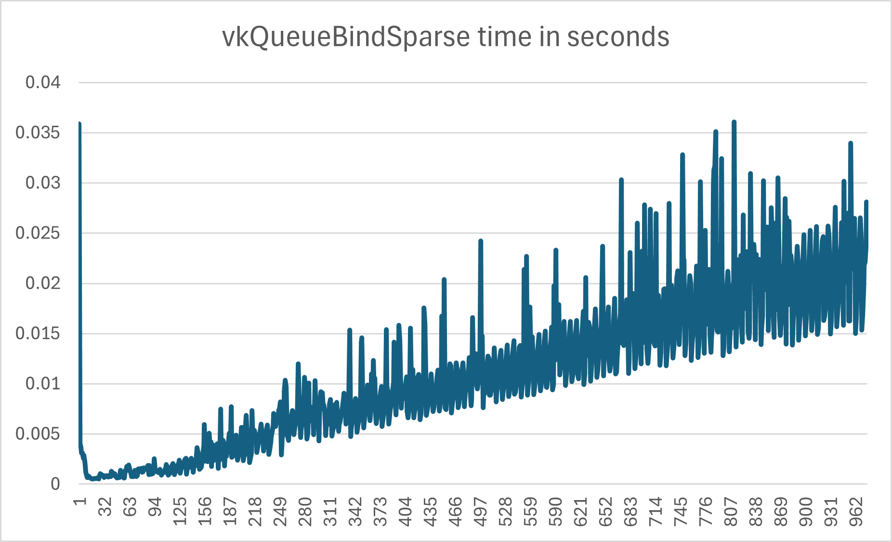

# Vulkan Sparse Textures
Sparse resources in Vulkan can be used to create virtual texture systems, or Giga-textures, but binding tiles to a sparse image is very slow.
The source code is hopefully self-explanatory, look at it for more details. This program binds pages in batches of 16 on a large image, covering more and more of the image. The time it takes to execute vkQueueBindSparse is measured and logged to a text file, bindTimes.txt. The greater the image extent, the greater the performance impact will be. This reproducer uses an image of the maximum extent on NVIDIA GPUs.

The real issue with vkQueueBindSparse being slow is that the main thread of the application is blocked by this, even if the bind is executed in a separate thread. Furthermore, the main thread of *other* applications doing vkQueueBindSparse is *also* blocked. This makes it difficult if not impossible to create a really scalable virtual texture system using sparse images in Vulkan.

# Dependencies
- Vulkan SDK
- NVIDIA GPU

## Build and run on Linux
```
SparseTexture$ docker build -f Scripts/Dockerfile -t sparsetexture-build Scripts
SparseTexture$ ./Scripts/run.sh
SparseTexture$ Build/SparseTexture
```

## Build and run on Windows
Open a developer powershell for Visual Studio 2022
```
SparseTexture> mkdir Build
SparseTexture> cd Build
SparseTexture\Build> cmake.exe ..\Code\
```
This generates the VS solution in the Build folder. Open, build and run.

## Output
The program generates a text file containing the time it takes to execute vkQueueBindSparse() for each batch of 16 binds. 
Below is an example of this file plotted in Excel.

The time it takes to bind 16 tiles of the sparse image is steadily increasing as we cover an larger area of the image.

